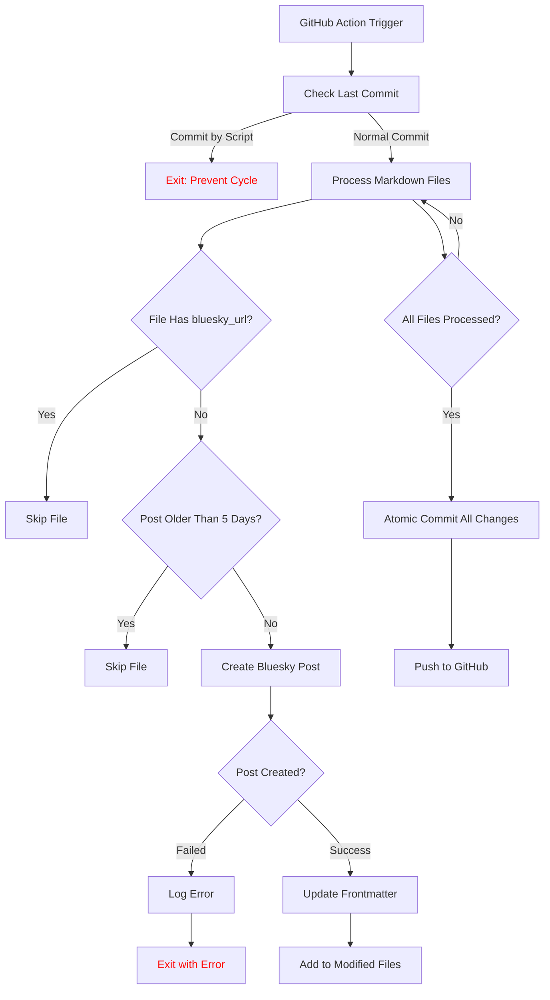

```mermaid
graph TD
    A[GitHub Action Trigger] --> B[Check Last Commit]
    B -->|Commit by Script| C[Exit: Prevent Cycle]
    B -->|Normal Commit| D[Process Markdown Files]
    D --> E{File Has bluesky_url?}
    E -->|Yes| F[Skip File]
    E -->|No| G{Post Older Than 5 Days?}
    G -->|Yes| H[Skip File]
    G -->|No| I[Create Bluesky Post]
    I --> J{Post Created?}
    J -->|Failed| K[Log Error]
    J -->|Success| L[Update Frontmatter]
    L --> M[Add to Modified Files]
    D --> N{All Files Processed?}
    N -->|No| D
    N -->|Yes| O[Atomic Commit All Changes]
    O --> P[Push to GitHub]
    K --> Q[Exit with Error]
    style C color:#f00
    style Q color:#f00
```
